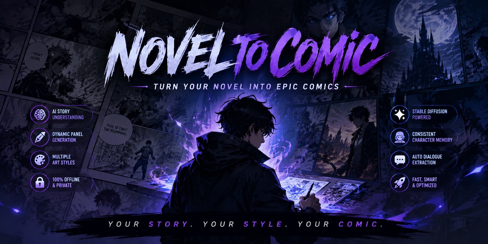
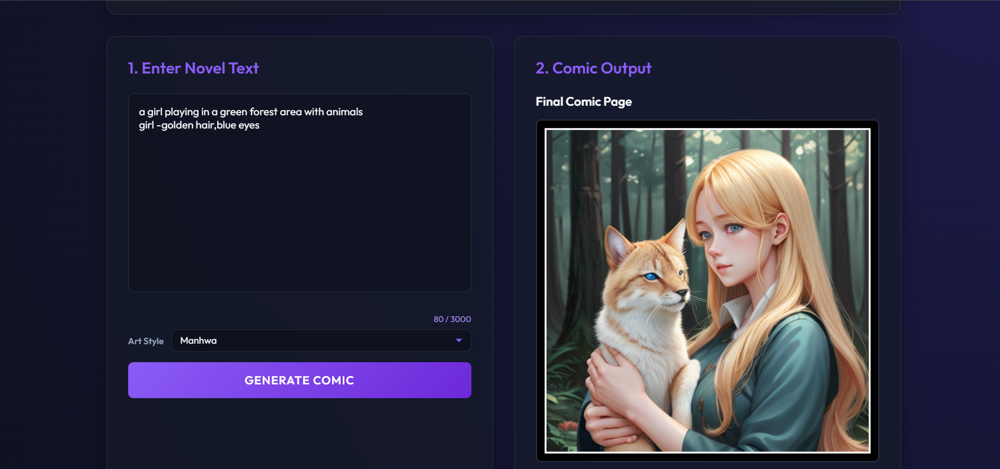
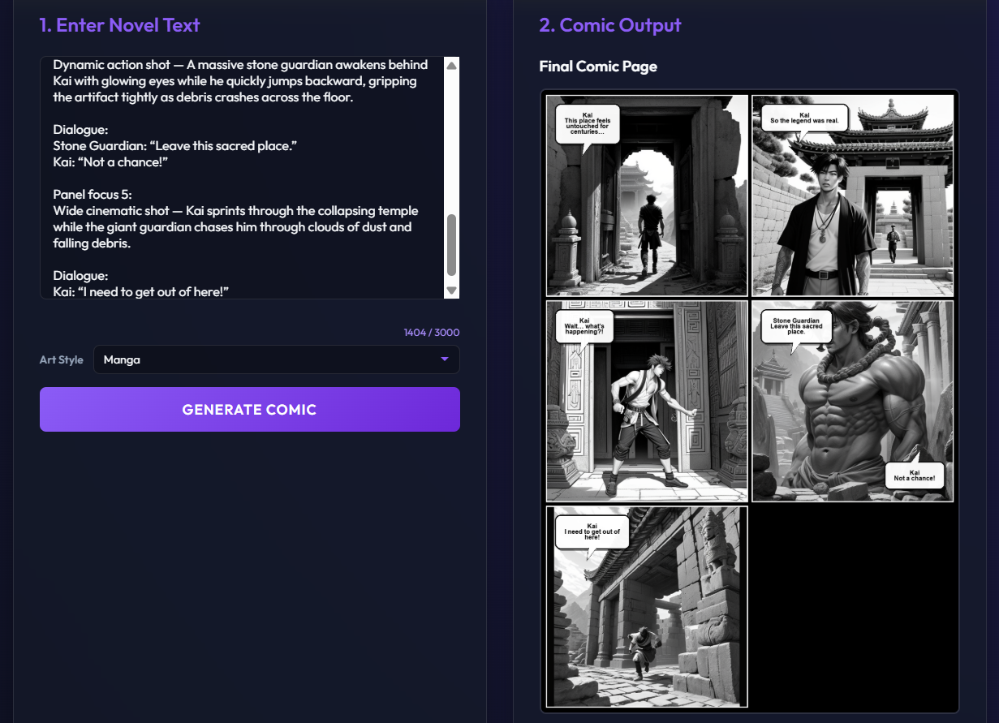
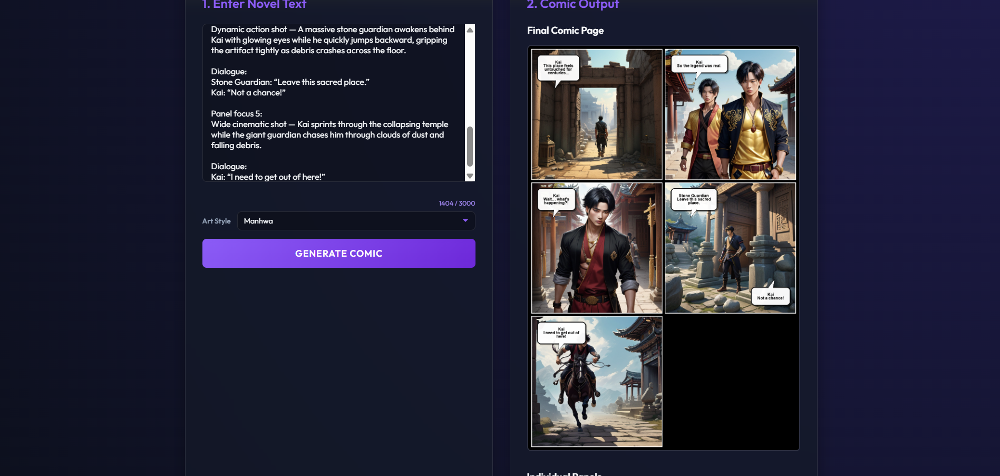
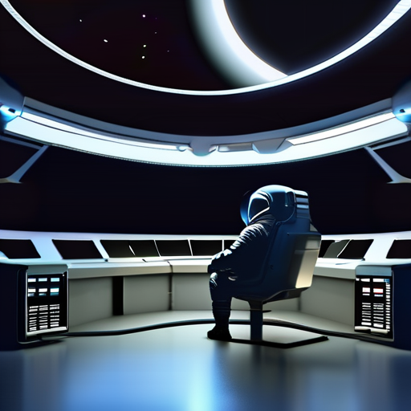
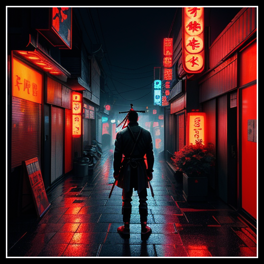
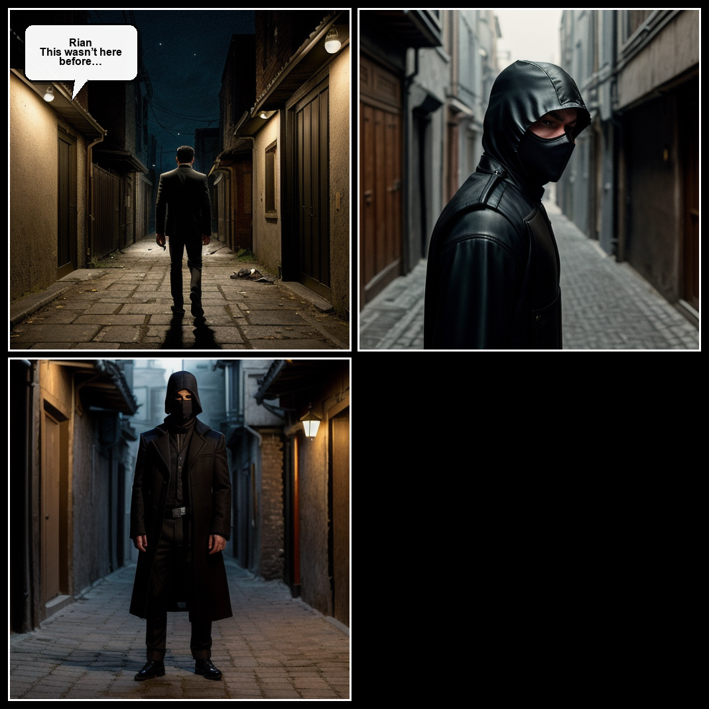

<div align="center">



<br/>

# 🎬 NovelToComic

### *Transform stories into cinematic comics using fully local AI.*

<br/>

[](https://python.org)
[](https://fastapi.tiangolo.com)
[](https://docker.com)
[](https://huggingface.co)
[](https://ollama.ai)
[](LICENSE)

<br/>

> **100% Offline • No API Keys • Full Local AI Storytelling Engine**

</div>

---

# ✨ What is NovelToComic?

**NovelToComic** is a fully local AI storytelling engine that converts novel scenes and narrative text into dynamic comic panels, manga pages, cinematic illustrations, and visual story sequences.

The system combines:
- 🧠 **Ollama (LLaMA 3)** for scene understanding and narrative extraction
- 🎨 **Stable Diffusion + ControlNet + IP-Adapter** for visual generation
- 📖 Dynamic panel generation based on story pacing and action flow

Everything currently runs locally on your machine.

No subscriptions. No paid APIs required.

---

# 💡 Why This Project Exists

Many AI storytelling platforms today rely heavily on cloud APIs and fixed-generation workflows.

NovelToComic was initially built as a local-first AI storytelling system focused on experimentation, flexibility, and full creative control.

The long-term vision is to evolve the project into a scalable storytelling platform capable of supporting:
- dynamic comic generation
- multiple art styles
- adaptive panel layouts
- cloud and local deployment modes
- AI-assisted storytelling workflows

The project focuses on:
- adaptive panel generation
- dynamic storytelling
- character consistency
- multiple visual styles
- modular AI architecture

---

# 🖥️ User Interface

<div align="center">



</div>

---

# 🖼️ Gallery

<div align="center">

## ⚔️ Manga Style Comic Generation



<br/><br/>

## 🎨 Manhwa Style Comic Generation



<br/><br/>

## 🌲 Anime Style — Single Panel Scene



<br/><br/>

## 🚀 Cinematic / Sci-Fi Style



<br/><br/>

## 🎬 Realistic Cinematic Storytelling



</div>

---

# 🚀 Features

| Feature | Description |
|---|---|
| 🎭 Dynamic Panel Count | AI determines panel count automatically based on narrative pacing |
| 🎨 Multi-Style Generation | Anime · Manga · Manhwa · Realistic · Cinematic |
| 💬 Dialogue Bubbles | Automatic speech extraction and bubble rendering |
| 🔒 Local-First Architecture | Entire pipeline currently runs locally |
| ⚡ VRAM Optimized | GPU memory management for stable generation |
| 🧠 Character Memory | Consistent characters across panels |
| 🎥 Scene-Aware Composition | Dynamic framing based on narrative context |
| 🐳 Docker Ready | Fully containerized deployment |
| 📊 Job Monitoring | Live generation tracking and status polling |
| 🔄 Dynamic Pose Injection | ControlNet activates only during action-heavy scenes |

---

# 🏗️ Architecture

```text
User Story Input
        │
        ▼
┌─────────────────────────────┐
│        Ollama LLM           │
│      (LLaMA 3 Parser)       │
└─────────────┬───────────────┘
              │
              ▼
┌─────────────────────────────┐
│     Scene Interpreter       │
│ Style Detection + Pacing    │
└─────────────┬───────────────┘
              │
              ▼
┌─────────────────────────────┐
│       Prompt Builder        │
│ Character + Environment     │
└─────────────┬───────────────┘
              │
              ▼
┌─────────────────────────────┐
│ Stable Diffusion Pipeline   │
│ + ControlNet + IPAdapter    │
└─────────────┬───────────────┘
              │
              ▼
┌─────────────────────────────┐
│       Comic Renderer        │
│  Panel Layout + Dialogue    │
└─────────────┬───────────────┘
              │
              ▼
        Final Comic Page
```

---

# 🔄 Example Workflow

```text
Novel Scene
    ↓
LLM Scene Extraction
    ↓
Scene Classification
    ↓
Prompt Generation
    ↓
Stable Diffusion Rendering
    ↓
Reference Conditioning
    ↓
Comic Layout Rendering
    ↓
Final Comic Page
```

---

# 🎨 Supported Styles

```python
MODEL_MAP = {
    "anime":     "Lykon/dreamshaper-8",
    "manga":     "Lykon/dreamshaper-8",
    "manhwa":    "Lykon/dreamshaper-8",
    "realistic": "SG161222/Realistic_Vision_V5.1_noVAE",
    "cinematic": "stabilityai/stable-diffusion-xl-base-1.0",
}
```

---

# 📁 Project Structure

```text
NovelToComic/
├── api/
├── config/
├── core/
├── frontend/
├── assets/
├── outputs/
├── Dockerfile
├── docker-compose.yml
├── setup.bat
└── requirements.txt
```

---

# ⚡ Quick Start

## Option A — Docker (Recommended)

```bash
git clone https://github.com/RD1241/NovelToComic.git

cd NovelToComic

docker compose up -d --build
```

Then open:

```text
http://localhost:8000
```

---

## Option B — Local Python Environment

```bash
cd NovelToComic

.\venv\Scripts\activate

ollama serve

uvicorn api.main:app --host 0.0.0.0 --port 8000
```

---

# 🐳 Docker Hub

The project can also be pulled directly from Docker Hub.

```bash
docker pull ramanduggal/noveltocomic
```

Run using:

```bash
docker compose up
```

This allows users to quickly launch the project without manually recreating the environment.

---

# 📦 Requirements

| Requirement | Minimum |
|---|---|
| Python | 3.10 |
| GPU VRAM | 6GB |
| RAM | 16GB |
| CUDA | 11.8+ |
| Disk Space | 25GB+ |

---

# ⚙️ Performance Notes

Typical performance on RTX-class GPUs:

| Task | Approx Time |
|---|---|
| Single Panel | 8–15 sec |
| Multi-Panel Comic | 40–120 sec |

Generation speed depends heavily on:
- selected style
- VRAM
- ControlNet usage
- SDXL usage

---

# ⚡ Optimization Highlights

| Optimization | Purpose |
|---|---|
| Dynamic VRAM Cleanup | Prevents GPU memory crashes |
| Model Caching | Avoids reloading pipelines repeatedly |
| Dynamic Pose Injection | Uses ControlNet only for action scenes |
| IP-Adapter Conditioning | Improves character consistency |
| Environment Locking | Prevents scene drift between panels |
| Dynamic Panel Count | Story pacing determines comic layout |

---

# 🗺️ Future Roadmap

- [ ] LoRA character fine-tuning
- [ ] PDF / CBZ export
- [ ] Custom comic layouts
- [ ] Cloud deployment support
- [ ] Real-time generation queue
- [ ] Apple Silicon support
- [ ] AI voice narration integration
- [ ] Web-based model manager

---

# 👨‍💻 Developer

## Raman Duggal (RD1241)

BCA (AI & ML) Student • Generative AI Enthusiast • Software Developer

GitHub:
https://github.com/RD1241

NovelToComic was built as an experimental AI storytelling system focused on transforming narrative text into cinematic comic-style visual experiences using LLMs and diffusion models.

---

# 📄 License

This project is licensed under the MIT License.

---

<div align="center">

### ⭐ If you like this project, consider giving it a star.

Built with ❤️ using AI, creativity, and local-first experimentation.

</div>
